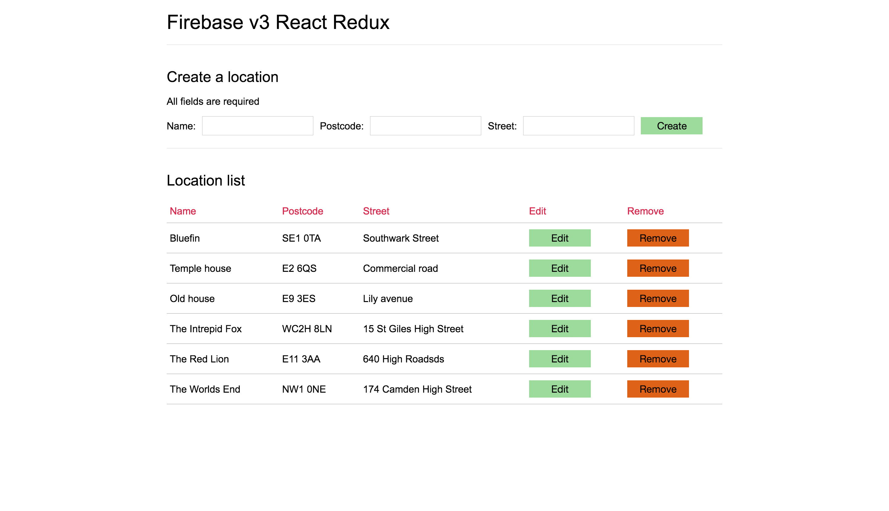
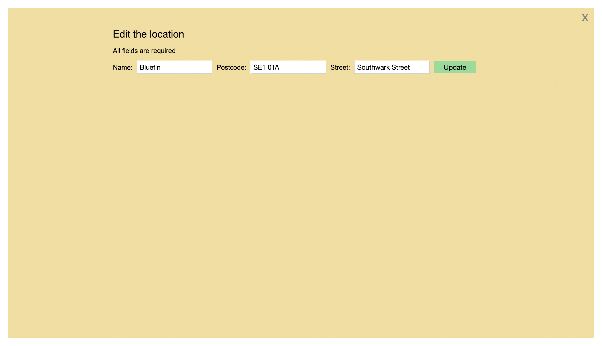

# Firebase v3 with React & Redux example and walkthrough

This is a walkthrough of how to get Firebase v3 working with React and Redux. This is a simple approach that involves dispatching an action once the data from Firebase has been received. This in turn passes the Firebase data to a reducer, creating a new state which will then update the view automatically due to React's way of dealing with life cycles.

### Firstly, a quick background on React, Redux & Firebase

#### React

React is a JavaScript library for creating user interfaces. It is useful for building large applications with data that changes over time.

#### Redux

Within a React application you will have your initial central state, Redux allows you to easily update the central state. It gives you the ability to connect the state with components that rely on the state so when the state is updated, the said component will re-render with the updated state.

#### Firebase

Firebase is a cloud-hosted NoSQL database. It's data is stored as JSON, synced across connected devices in milliseconds and gives you the ability to retrieve and update data.


---


## Retrieving, updating, adding & removing data





### How to run

Clone or pull this repo to see a working example that lists locations in a table with data pulled from a Firebase database. You can add more locations while deleting them and editing them. All changes will be automatically saved in the Firebase database and re-render the components in the React application.

1. `git clone` repo
2. `npm install` to get the node_modules
3. `npm start` to initialize the app
4. visit [http://localhost:8080/](http://localhost:8080/)

### Setting up Firebase in your project

Adding the below code to the base of your `<body>` above any other JavaScript references in your `index.html` will initialise the call to the Firebase database.
You will need to add your own `apiKey`, `authDomain`, `databaseURL` and `storageBucket`.

```html
<script src="https://www.gstatic.com/firebasejs/3.1.0/firebase.js"></script>
    <script>
    // Initialise Firebase
    var config = {
        apiKey: '<your-api-key>',
        authDomain: '<your-auth-domain>',
        databaseURL: '<your-database-url>',
        storageBucket: '<your-storage-bucket>'
    };
    firebase.initializeApp(config);
</script>
```

---


### Retrieve data from Firebase

After setting up the `Redux store` you need to dispatch an action that passes the `snapshot.val()` to the `action creator` and in turn dispatches the object to the reducers. Please note I am using ES6 arrow functions which means you need to be using a transpiler such as [Babel](https://babeljs.io/) for it to work on browsers that do not support ES6 yet.

```javascript
// combines all reducers, one in this case...
const Reducer = combineReducers({
    locations: LocationsReducer
});

// creates the Redux store with the combined reducer variable
const Store = createStore(Reducer);

// action that creates an object containing the new data and the type of action
const populateLocations = (data) => {
    return {
        type: 'ALL_LOCATIONS',
        data: data
    }
}

// We get the stored Firebase JSON once and on completion we fire off a dispatch
firebase.database().ref('/').once('value').then((snapshot) => {
    Store.dispatch(populateLocations(snapshot.val()));
});

// populateLocations action that returns an object of the data and type so when it is passed into the reducer, we know what should be updated
function LocationsReducer (data) {
    return {
        type: 'ALL_LOCATIONS',
        data: data
    }
}
```

**Creating a new state with the Firebase data**

After dispatching the action `populateLocations`, the Firebase data is returned, the `newState` is updated with the `action.data.locations`. The `action` is the object containing the `type` and `data` which we created in the action `populateLocations`.

```javascript
// LocationsReducer is automatically called by Redux when a dispatch occurs
var LocationsReducer = (state = {}, action) => {

    var newState = Object.assign({}, state);

    switch (action.type) {
        case 'ALL_LOCATIONS':

            newState = action.data.locations
            return newState;

        default:
            return state;
    }
}
```

---


### Push data to Firebase

Clicking the 'Create location' submit button, the `pushLocation()` is called. A new object is created using the fields we would like to update, with the properties relating to the 'create location' form input fields. We only need to go one level deep when pushing to the locations object. On push, there is a function that wipes the content of each input field ready to add another location.

```html
<button type="submit" onClick={() => this.pushLocation()}>
    Create location
</button>
```

```javascript
pushLocation () {

    // creating the object that will be pushed to the object in the database
    var newLocation = {
        name: document.getElementById('name').value,
        postCode: document.getElementById('postCode').value,
        street: document.getElementById('street').value
    }

    firebase.database().ref('/locations').push(newLocation, function () {
        document.getElementById('name').value = null;
        document.getElementById('postCode').value = null;
        document.getElementById('street').value = null;
    });
}
```

---

### Update specific data fields in Firebase

Clicking the 'Update location' button, the `updateLocation()` is called.

```javascript
updateLocation (ref) {
    var newData = {
        name: document.getElementById('edit-name').value,
        postCode: document.getElementById('edit-postCode').value,
        street: document.getElementById('edit-street').value
    }

    var updatedLocation = {};
        updatedLocation['/locations/' + ref] = newData;

    firebase.database().ref().update(updatedLocation);
}
```

---

### Remove data in Firebase

Clicking on the 'Remove location' button, the `removeLocation()` is called. Here we are passing the `item` which is the unique key for that location in the database. Referencing this in the `removeLocation()` we can remove that location like below.

```html
<button type="button" onClick={() => this.removeLocation(item)}>
    Remove location
</button>
```

```javascript
removeLocation (ref) {
    firebase.database().ref('/locations/' + ref).remove();
}
```

---

### Help improve this

Although this is working for me, if you see anything that can be improved or a different method entirely, just pull and let me know what can be improved. This way I can do it properly the next time :)
